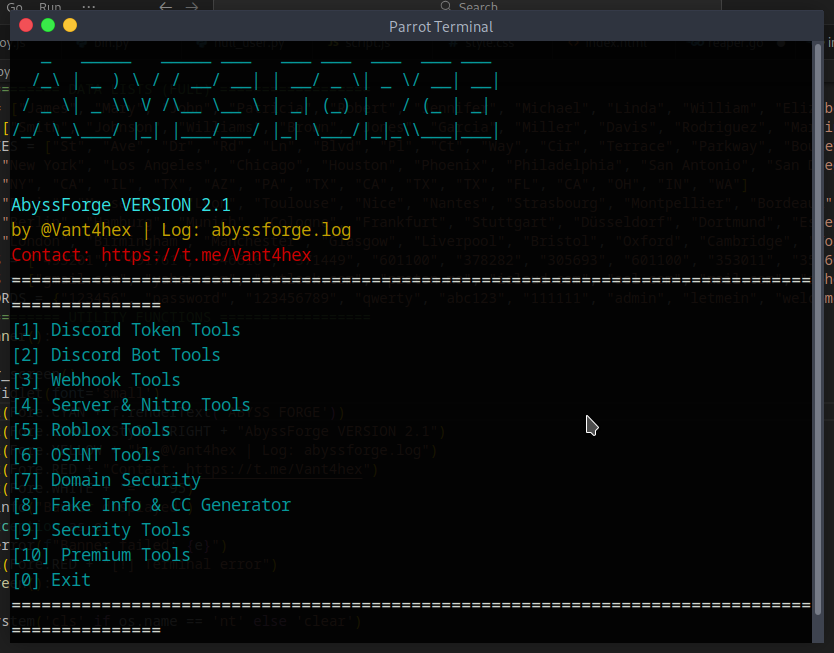

# AbyssForge v2.1
**🔥 AbyssForge Multi-Tool – 40+ Tools by @Vant4hex**

> **Discord Nuker • Token Grabber • Webhook Spammer • OSINT Suite • Port Scanner • Fake CC Gen • AES Encryptor and More**  

---

## 📋 Quick Stats
- **Tools**: 40+   
- **Log**: `abyssforge.log`

---

## 🚀 Features

| Section | Tools |
|---------|-------|
| **1. Discord Token** | Info, Nuker, Join/Leave, ID Extract, Spam, Mass DM, Del/Block Friends (9 tools) |
| **2. Discord Bot** | Nuke Server, Invite Gen |
| **3. Webhook** | Info, Delete, Spam, Generator |
| **4. Server/Nitro** | Server Info, Nitro Codes |
| **5. Roblox** | Cookie Login, Cookie Info, User/ID Info |
| **6. OSINT** | EXIF, IP Lookup, Username (50+ sites), Email Breach, Phone Carrier, Dorks, Website Tech |
| **7. Domain Security** | Subdomains (100+), SSL SANs, DNS Records, Headers Audit, WHOIS Age, Vuln Scan, Port Scanner |
| **8. Fake Info & CC** | Profiles + Luhn-Valid CCs (US/FR/DE/UK) |
| **9. Security** | Password Entropy, Hash Cracker, WiFi Viewer, AES Encrypt/Decrypt |
| **10. Premium** | RAT, Ransomware, DoS, Roblox 2FA Bypass, Steam 2FA Bypass (LOCKED) |

---

## 💻 Installation

### **Windows**
1. **Python 3.9+** → [Download](https://python.org/downloads) **(Check "Add to PATH")**
2. **CMD as Admin**:

**Requirements**
pip install requests colorama pyfiglet exifread pycryptodome tqdm psutil

3.**Run**

git clone https://github.com/Vant4hex/AbyssForge.git

cd AbyssForge

python abyssforge.py

### **Linux Users (Ubuntu/Debian/Kali)**

1. **Update System**
   sudo apt update && sudo apt install python3 python3-pip git -y

2. **install dependencies**

   pip3 install requests colorama pyfiglet exifread pycryptodome tqdm psutil
3. **Clone & Run** 
   git clone https://github.com/Vant4hex/AbyssForge.git

   cd AbyssForge

   python3 abyssforge.py

   ## ⚠️ Disclaimer
**EDUCATIONAL ONLY** – Use on **your own systems** or with **permission**.  
**No responsibility** for misuse. Discord/Roblox ToS apply.

---

## 📞 Support
- **Telegram**: `@Vant4hex` (Premium + Support)  

   
  ## **SCREENSHOTS**

  

## **LICENSE**

MIT License

Copyright (c) 2025 Vant4hex

Permission is hereby granted, free of charge, to any person obtaining a copy...
[Full MIT text – copy from GitHub]

